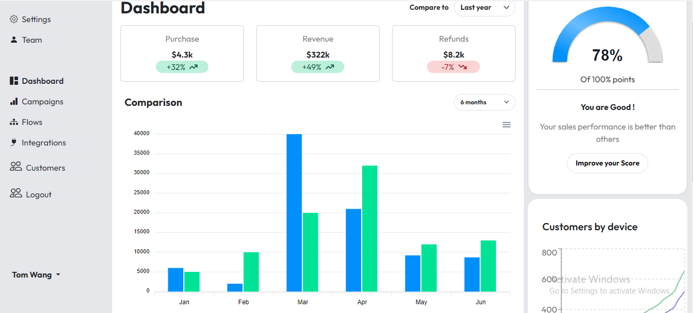

# Ungray Assignment Dashboard

## Introduction
he Assignment Dashboard is a front-end application that integrates various components, each fetching data from specific APIs.It includes a login page with authentication and redirects users dashboard in form of Cards,Charts,Graph and features based on user authentication.


## Technology Stack
- React: A JavaScript library for building user interfaces.
- Axios: Promise-based HTTP client for making API requests.
- Flowbite: A responsive CSS framework for building modern web interfaces.
- Tailwind CSS: A utility-first CSS framework for styling.
- React Router: Routing library for React applications.


## Deployment

- Frontend: https://ungray-assignment-dashboard.vercel.app/  


## Features
- Authentication: Login functionality with credentials.
- Component Data Display: Integration of tabular data from APIs and hardcoded data.
- API Integration: Utilization of Swagger for API testing and documentation.

## Design Decisions
- Implemented a clean and responsive UI using Flowbite and Tailwind CSS.
- Used React Router for seamless navigation between components.
- Ensured accessibility and usability with responsive design principles.

## Design 🎨

### --Login Interface-


### --Dashboard Interface-



## APIs Used
- Component 1: [API Link](http://ec2-3-83-254-115.compute-1.amazonaws.com:8020/sample_assignment_api_1/)
- Component 3: [API Link](http://ec2-3-83-254-115.compute-1.amazonaws.com:8020/sample_assignment_api_3/)
- Component 4: [API Link](http://ec2-3-83-254-115.compute-1.amazonaws.com:8020/sample_assignment_api_4/)
- Component 5: [API Link](http://ec2-3-83-254-115.compute-1.amazonaws.com:8020/sample_assignment_api_5/)

## Installation & Getting Started 🚀
To run the project locally, follow these steps:

1. **Clone the repository**:
    ```bash
    git clone https://github.com/MayankBelwal05/ungray-assignment-dashboard.git
    ```
2. **Navigate to the project directory**:
    ```bash
    cd frontend
    ```
3. **Install dependencies**:
    ```bash
    npm install
    ```
4. **Start the server**:
    ```bash
    npm run dev
    ```